# Stories from FIFA World Cup 2022 — Interactive Visual Analytics

CS661 course project. An interactive web app that tells the story of the 2022 FIFA
World Cup through **12 coordinated visualizations**, built on StatsBomb open data —
including the 360 freeze-frame dataset. Drill from tournament-wide trends down to a
single shot's tactical context.

Stack: **Streamlit · Plotly · statsbombpy · mplsoccer · scipy · networkx · shapely · pandas**

---

## Quick start

```bash
# 1. create + activate a virtual environment
python -m venv .venv
.venv\Scripts\activate            # Windows (PowerShell: .\.venv\Scripts\Activate.ps1)
# source .venv/bin/activate       # macOS / Linux

# 2. install dependencies
pip install -r requirements.txt

# 3. fetch the data once (~5–10 min; writes parquet snapshots to data/cache/)
python scripts/fetch_data.py

# 4. run the app
streamlit run app.py
```

Open the printed `Local URL` (default http://localhost:8501). First load builds caches
(~a few seconds); afterwards everything is instant. Use the sidebar's **Refresh data**
button to clear caches.

> The data files in `data/cache/*.parquet` are **gitignored** — run step 3 after cloning.

---

## The 12 visualizations

### Tab 1 — Tournament

#### 1.1 Interactive Knockout Bracket
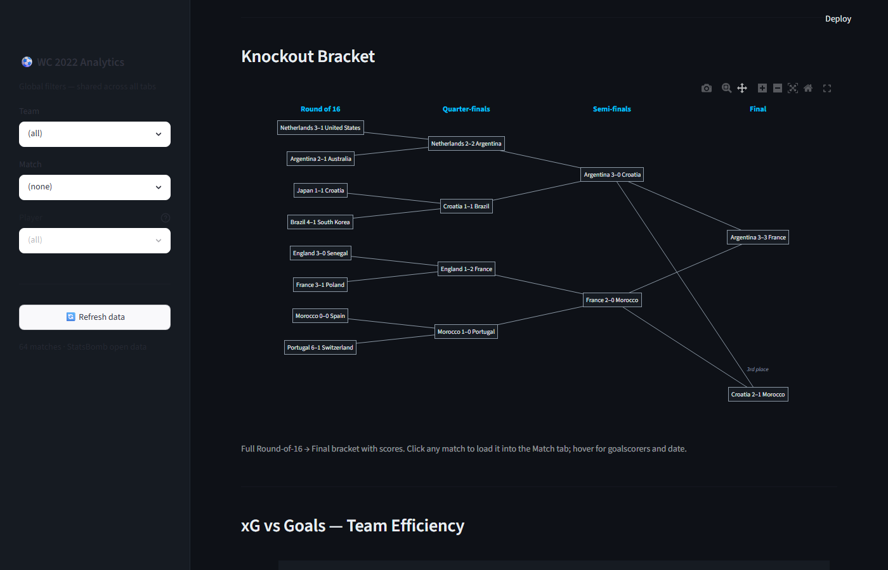

R16→Final structure with scores. Click any match to jump directly to that match in the Match tab.

---

#### 1.2 xG vs Goals Scatter
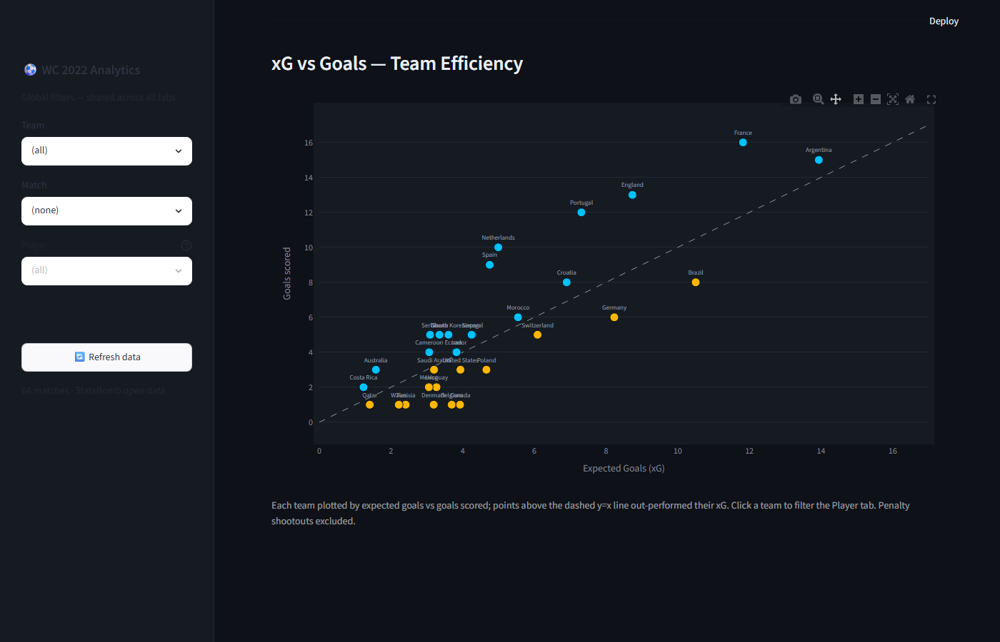

Team finishing efficiency plotted against a y=x reference line. Over-performers sit above the line; click a team dot to navigate to the Player tab for that squad.

---

### Tab 2 — Match

#### 2.1 Match Momentum
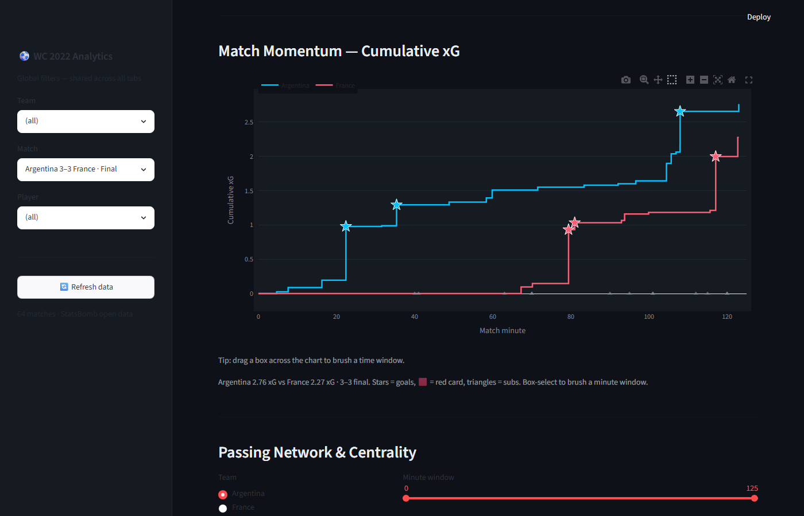

Cumulative xG timeline for both teams across the match. Box-select any minute window to brush-link the Shot Map, Passing Network, and Time-Scrubber to that time range.

---

#### 2.2 Animated Time-Scrubber
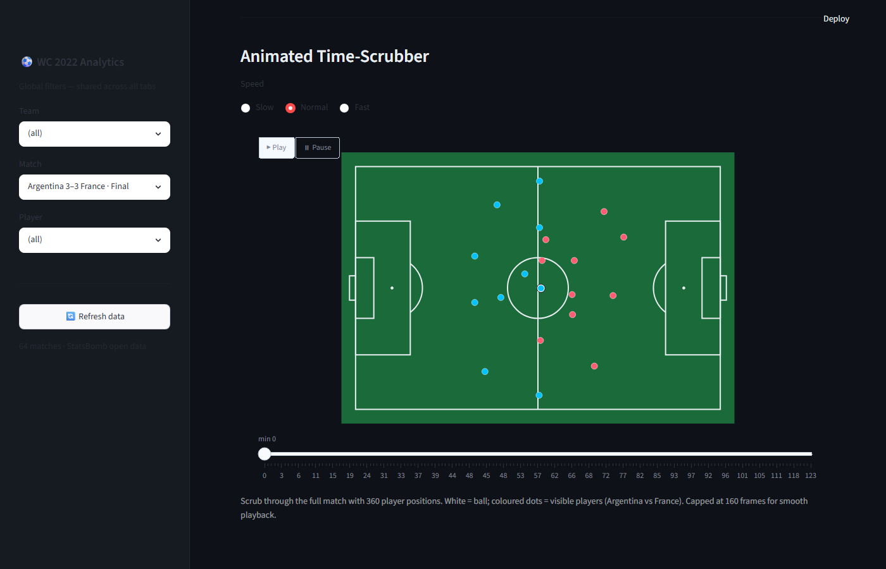

Ball position and 360 player locations animated through the match using Plotly frames. Scrub to any moment; linked to the momentum brush window.

---

#### 2.3 Passing Network
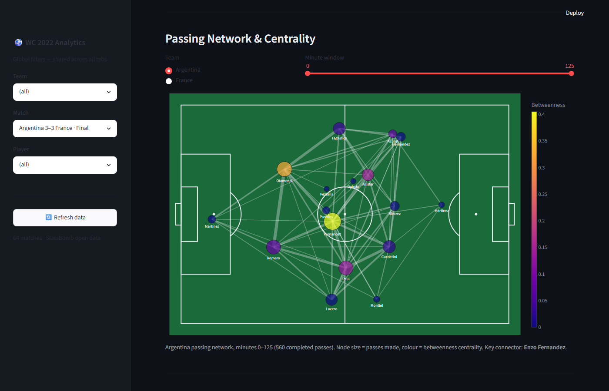

Players plotted at their average positions; edge thickness = pass volume, edge colour = betweenness centrality. Reveals the structural spine of each team's build-up play.

---

#### 2.4 Shot Map + 360 Freeze-Frame
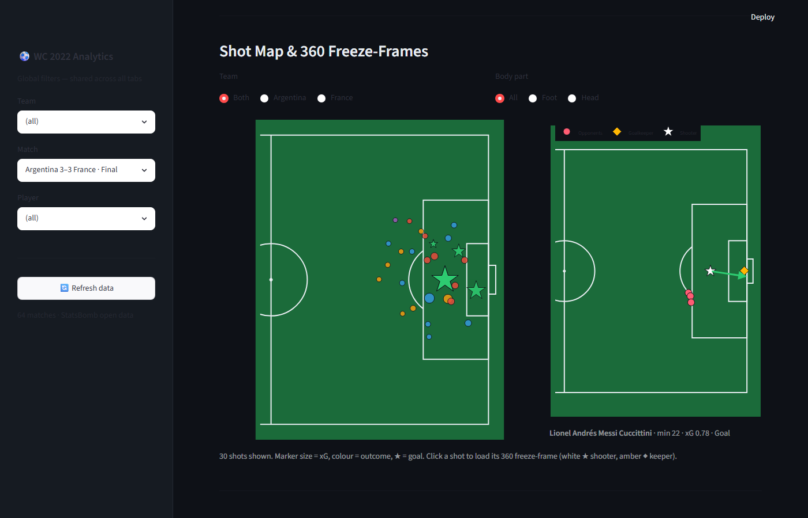

Every shot on the pitch (size = xG, colour = outcome). Click any shot to open a 360 freeze-frame panel showing all 22 players at the moment of the attempt.

---

### Tab 3 — Player

#### 3.1 Action Density Heatmap
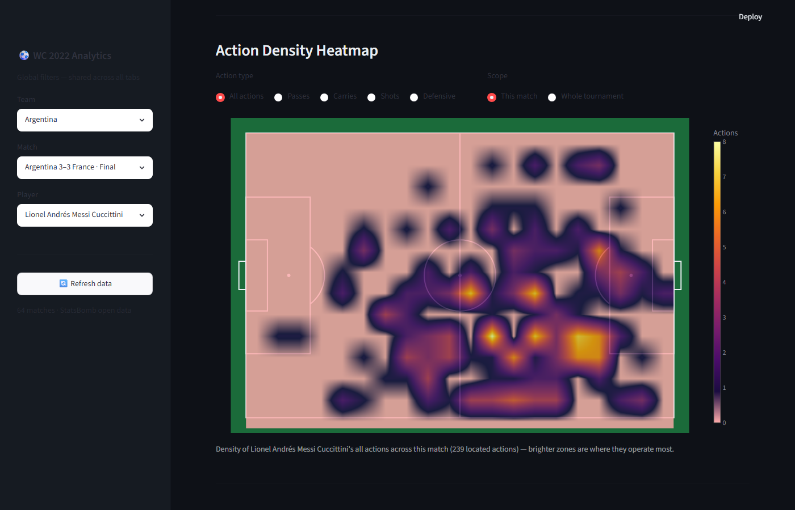

KDE heatmap showing where a player operates on the pitch. Toggle action type (passes, carries, shots, duels) and scope (all matches vs single match).

---

#### 3.2 Progressive Pass & Carry Map
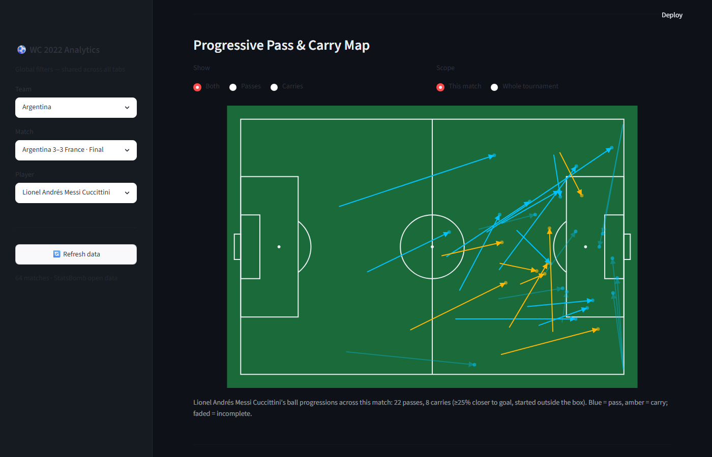

All passes and carries that moved the ball ≥25% closer to goal, drawn as arrows on the pitch. Shows a player's direct contribution to advancing possession.

---

#### 3.3 3D Shot Trajectories
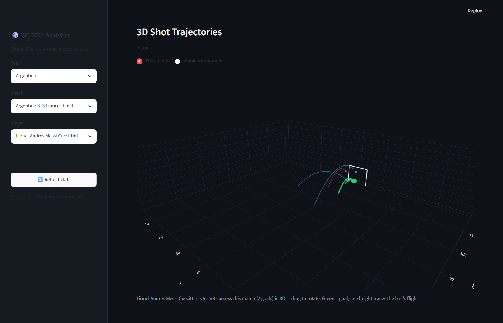

The player's shots rendered as arcs toward goal in 3D (Plotly surface). Colour encodes outcome; height encodes the ball's flight path.

---

#### 3.4 Goalmouth Placement
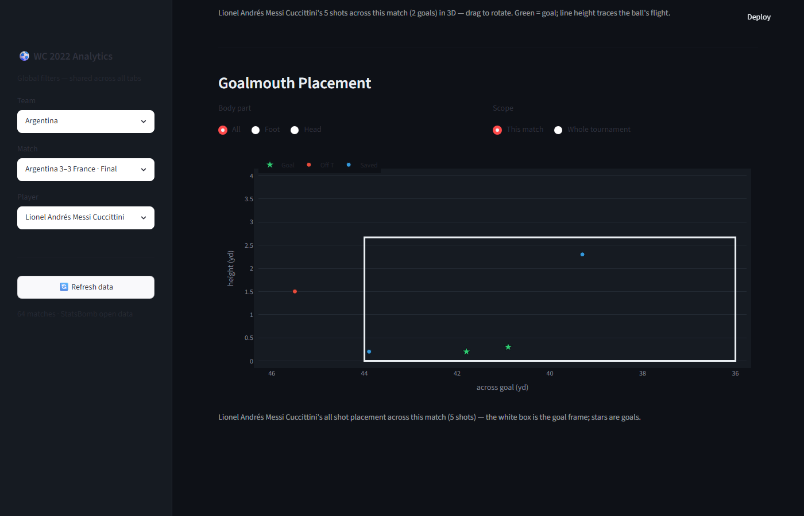

Shot end-placement projected onto the goal-frame plane. Immediately shows where a player targets (corners, low, high) and which attempts were saved vs scored.

---

### Tab 4 — Tactical

#### 4.1 Voronoi Pitch Control
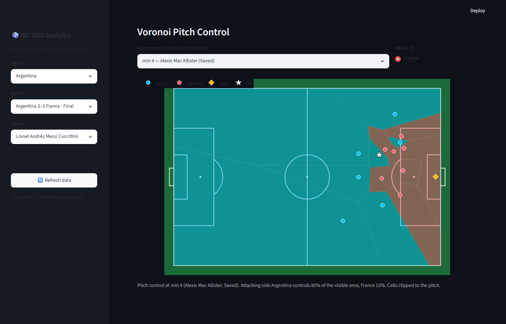

The pitch partitioned into zones controlled by each team using Voronoi tessellation (scipy + shapely). Colour intensity shows how contested each region is.

---

#### 4.2 xT Surface + Possession Replay
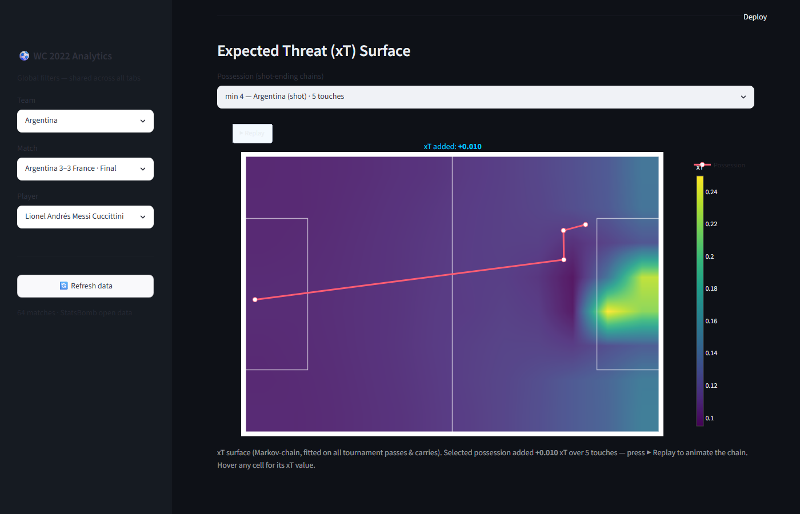

Markov-chain Expected Threat grid overlaid on the pitch. Animate any selected possession sequence to watch the xT value climb as the ball progresses toward goal.

---

Cross-tab links: **bracket → Match**, **team scatter → Player**, **momentum brush → shot
map / passing network / scrubber** (all share `session_state`).

---

## Architecture

Four horizontal layers — each file has a single responsibility.

```
fifa-wc2022-va/
├── app.py                  # entry: page config, sidebar filters, session-state tab nav
├── data/
│   ├── loader.py           # cached parquet loaders (matches / events / 360)
│   ├── transforms.py       # event → shots / passes / carries / possessions
│   └── cache/              # parquet snapshots (gitignored)
├── analytics/
│   ├── xt_model.py         # Expected Threat (Markov-chain value iteration)
│   ├── pitch_control.py    # Voronoi cells + pitch clipping
│   ├── network_metrics.py  # passing-network builder + betweenness
│   └── progression.py      # progressive pass / carry filters
├── viz/
│   ├── pitch.py            # reusable StatsBomb pitch (Plotly) — used by 7 visuals
│   ├── tab1_tournament.py  # 1.1, 1.2
│   ├── tab2_match.py       # 2.1–2.4
│   ├── tab3_player.py      # 3.1–3.4
│   └── tab4_advanced.py    # 4.1, 4.2
├── utils/
│   ├── state.py            # session_state keys + get_filtered_events()
│   └── styling.py          # palette + CSS injection
├── SCHEMA.md               # StatsBomb data dictionary
└── scripts/fetch_data.py   # one-time data download
```

## Data source

StatsBomb Open Data — FIFA World Cup 2022 (`competition_id=43`, `season_id=106`):
64 matches, 234,637 events, ~3M 360 freeze-frame rows. See [SCHEMA.md](SCHEMA.md) for
the full column dictionary. (One match, `3869152`, has no 360 data — handled with a
graceful fallback.)

## Notes

- Pitch coordinates are StatsBomb 120×80; attacking goal at x=120.
- xT uses the turnover-free Markov model (relative threat surface).
- Built solo with Claude Code as coding assistant.
